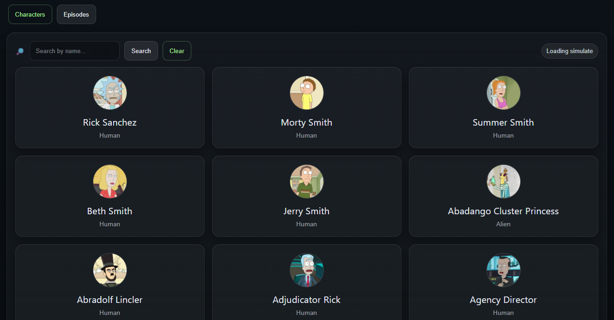
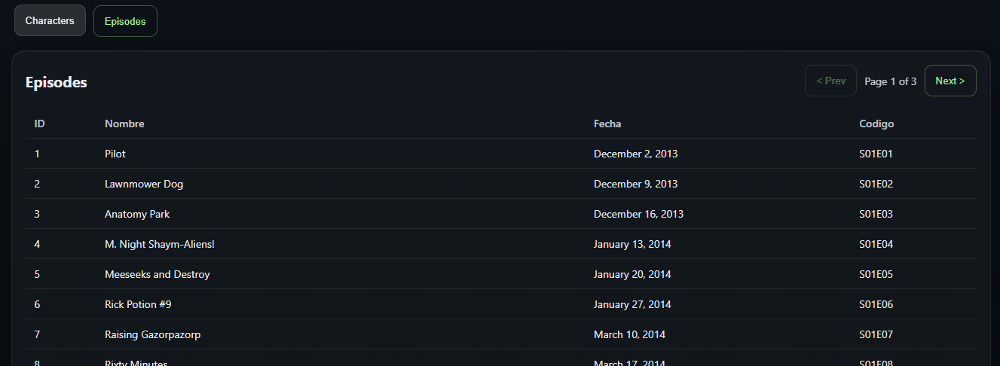

# PruebaTecnicaCarsales.Bff (.NET 8) — BFF Rick & Morty

Backend-for-Frontend (BFF) en **.NET 8** que consume la API pública de Rick and Morty y expone endpoints propios para **Episodes** y **Characters** con **paginación**, **filtro por nombre**, **manejo de errores** y **configuración por appsettings**.

---

## Requisitos

- **.NET SDK 8.x**
- (Opcional) Visual Studio 2022 / VS Code
- API externa utilizada: Rick and Morty API

---

## Configuración

La configuración se encuentra en `appsettings.json`:

```json
{
  "RickAndMortyApi": {
    "BaseUrl": "https://rickandmortyapi.com/api/",
    "TimeoutSeconds": 10
  }
}
```

---

## Scripts de desarrollo

Primer uso (despues de clonar):
1. Abrir PowerShell o CMD en la raiz del repo
2. Ejecutar:

```powershell
powershell -ExecutionPolicy Bypass -File .\setup-and-run.ps1
```

Uso diario:
- Iniciar dev: `start-dev.bat` (levanta frontend y backend)
- Detener y liberar puertos (4200/7257/5296): `stop-dev.bat`

El script `setup-and-run.ps1` instala dependencias del frontend (npm install), restaura el backend (dotnet restore) y luego levanta ambos servicios.

---

## Estructura

- Frontend (Angular): `frontend/PruebaTecnicaCarsales-Frontend`
  - Entry: `src/app` (standalone components + app config)
  - Features: `src/app/features` (characters, episodes, home)
  - Shared: `src/app/shared` (models, tokens)
  - Estilos globales: `src/styles/ui.css`
- Backend (BFF .NET 8): `backend/PruebaTecnicaCarsales.Backend`
  - Solucion: `PruebaTecnicaCarsales.Backend.slnx`
  - Proyecto: `PruebaTecnicaCarsales.Bff`
  - Controllers: `PruebaTecnicaCarsales.Bff/Controllers` (`/characters`, `/episodes`)
  - Application: `PruebaTecnicaCarsales.Bff/Application` (use cases)
  - Infrastructure: `PruebaTecnicaCarsales.Bff/Infrastructure` (cliente Rick & Morty)
  - Config: `PruebaTecnicaCarsales.Bff/appsettings.json`

---

## Uso basico

- Frontend: `npm run start` dentro de `frontend/PruebaTecnicaCarsales-Frontend`
- Backend: `dotnet run` dentro de `backend/PruebaTecnicaCarsales.Backend`
- CORS: backend permite `http://localhost:4200`

---

## Endpoints (BFF)

Base URL (local): `https://localhost:7257`

### GET `/characters`

Query params:
- `page` (number, default: 1, min: 1)
- `name` (string, opcional)

Respuesta (200):
```json
{
  "count": 826,
  "pages": 42,
  "next": "https://rickandmortyapi.com/api/character?page=2",
  "prev": null,
  "results": [
    {
      "id": 1,
      "name": "Rick Sanchez",
      "status": "Alive",
      "species": "Human",
      "type": "",
      "gender": "Male",
      "origin": { "name": "Earth (C-137)", "url": "https://rickandmortyapi.com/api/location/1" },
      "location": { "name": "Citadel of Ricks", "url": "https://rickandmortyapi.com/api/location/3" },
      "image": "https://rickandmortyapi.com/api/character/avatar/1.jpeg"
    }
  ]
}
```

Errores posibles:
- `400` si `page` < 1
- `502/504` si falla la API externa

---

## Screenshots




### GET `/episodes`

Query params:
- `page` (number, default: 1, min: 1)
- `name` (string, opcional)

Respuesta (200):
```json
{
  "count": 51,
  "pages": 3,
  "next": "https://rickandmortyapi.com/api/episode?page=2",
  "prev": null,
  "results": [
    {
      "id": 1,
      "name": "Pilot",
      "airDate": "December 2, 2013",
      "episodeCode": "S01E01"
    }
  ]
}
```

Errores posibles:
- `400` si `page` < 1
- `502/504` si falla la API externa
